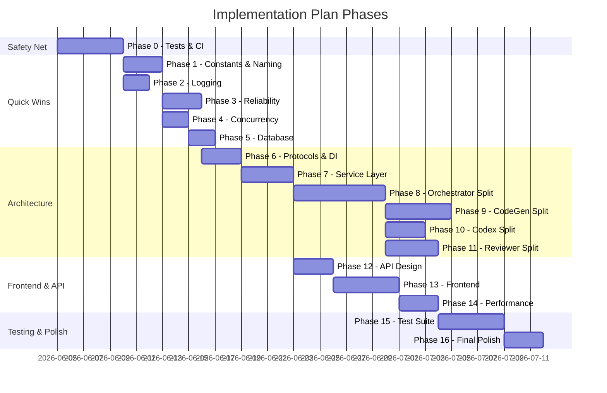

# IMPLEMENTATION PLAN: 100/100 Engineering Quality

**Goal:** Bring every audit category to 100/100 without breaking any existing functionality.  
**Guiding Principle:** Every refactoring step MUST pass the existing test suite and maintain identical external behavior (same API contracts, same WebSocket events, same CLI behavior, same pipeline outcomes).  
**Strategy:** Wrap → Extract → Inject → Remove (never rewrite in-place).

---

## TABLE OF CONTENTS

1. [Phase 0 — Safety Net (Tests & CI)](#phase-0--safety-net-tests--ci)
2. [Phase 1 — Constants, Enums & Naming](#phase-1--constants-enums--naming)
3. [Phase 2 — Logging & Observability](#phase-2--logging--observability)
4. [Phase 3 — Reliability & Error Handling](#phase-3--reliability--error-handling)
5. [Phase 4 — Concurrency & Thread Safety](#phase-4--concurrency--thread-safety)
6. [Phase 5 — Database Hardening](#phase-5--database-hardening)
7. [Phase 6 — Protocol Interfaces & DI](#phase-6--protocol-interfaces--di)
8. [Phase 7 — Service Layer Extraction](#phase-7--service-layer-extraction)
9. [Phase 8 — God Class Decomposition (Orchestrator)](#phase-8--god-class-decomposition-orchestrator)
10. [Phase 9 — God Class Decomposition (CodeGeneratorRunner)](#phase-9--god-class-decomposition-codegeneratorrunner)
11. [Phase 10 — God Class Decomposition (CodexWrapper)](#phase-10--god-class-decomposition-codexwrapper)
12. [Phase 11 — God Class Decomposition (CodeReviewerRunner)](#phase-11--god-class-decomposition-codereviewerrunner)
13. [Phase 12 — API Design & Routing](#phase-12--api-design--routing)
14. [Phase 13 — Frontend Architecture](#phase-13--frontend-architecture)
15. [Phase 14 — Performance Optimization](#phase-14--performance-optimization)
16. [Phase 15 — Comprehensive Test Suite](#phase-15--comprehensive-test-suite)
17. [Phase 16 — Final Polish & Documentation](#phase-16--final-polish--documentation)

---

## REFACTORING SAFETY RULES

These rules apply to EVERY phase:

1. **Green Bar First** — Before any refactoring, all existing tests MUST pass.
2. **One Change at a Time** — Each sub-task is a single, reviewable commit.
3. **Behavioral Equivalence** — After each commit, run the full test suite. If any test fails, revert.
4. **Adapter Pattern** — When splitting a class, keep the old interface alive as a thin facade that delegates to new classes. Remove facade only after all callers are migrated.
5. **Feature Flags** — If a change is risky, gate it behind a config flag. Remove flag after validation.
6. **No Big Bang** — Never rewrite more than one module per commit. Always keep the system runnable.
7. **Test Before Refactor** — For any module about to be decomposed, first write characterization tests that lock down its current behavior.

---

## PHASE 0 — SAFETY NET (TESTS & CI)

**Purpose:** Before touching anything, create a regression safety net. This ensures no subsequent phase can silently break functionality.

**Target Score Impact:** Testability 25→45, all other scores protected.

### 0.1 — Characterization Tests for Core Pipeline

Create tests that exercise the FULL pipeline flow with mocked external dependencies (subprocess, OpenAI, GitHub API). These tests lock down the current behavior so that refactoring in later phases cannot silently break it.

**Files to create:**
```
tests/
├── conftest.py                          # Shared fixtures
├── characterization/
│   ├── __init__.py
│   ├── test_orchestrator_standard.py    # Full standard mode flow
│   ├── test_orchestrator_ghr.py         # Full github_review mode flow
│   ├── test_code_generator_flow.py      # CodeGen → Git → PR flow
│   ├── test_code_reviewer_flow.py       # Diff → LLM → Score flow
│   ├── test_websocket_events.py         # Event emission sequence
│   └── test_state_transitions.py        # All valid/invalid transitions
├── unit/
│   ├── __init__.py
│   ├── test_state_machine.py            # StateManager pure logic
│   ├── test_requirements_parser.py      # RequirementsParser pure logic
│   ├── test_config_loader.py            # Config resolution logic
│   └── test_git_ops_manager.py          # GitOpsManager with mocked subprocess
└── integration/
    ├── __init__.py
    ├── test_api_endpoints.py            # All 24 endpoints
    └── test_database_operations.py      # Schema, CRUD, migrations
```

**Implementation Steps:**

| # | Task | File(s) | Risk | Validation |
|---|------|---------|------|------------|
| 0.1.1 | Create `tests/conftest.py` with shared fixtures: `tmp_config`, `mock_db`, `mock_subprocess`, `mock_openai`, `mock_vcs_client` | `tests/conftest.py` | NONE | Fixtures import cleanly |
| 0.1.2 | Write `test_state_transitions.py` — assert all valid transitions succeed, all invalid transitions raise `InvalidTransitionError` | `tests/unit/test_state_machine.py` | NONE | pytest passes |
| 0.1.3 | Write `test_requirements_parser.py` — parse sample YAML, validate schema output | `tests/unit/test_requirements_parser.py` | NONE | pytest passes |
| 0.1.4 | Write characterization test for standard pipeline: mock subprocesses → start → load_requirements → prompt_gen → approve → code_gen → code_review → approve → complete | `tests/characterization/test_orchestrator_standard.py` | LOW | Full flow completes |
| 0.1.5 | Write characterization test for github_review pipeline | `tests/characterization/test_orchestrator_ghr.py` | LOW | Full GHR flow |
| 0.1.6 | Write `test_websocket_events.py` — start pipeline, collect all WS events, assert ordering | `tests/characterization/test_websocket_events.py` | LOW | Event sequence matches |
| 0.1.7 | Write `test_api_endpoints.py` — test all 24 routes with FastAPI TestClient | `tests/integration/test_api_endpoints.py` | LOW | All endpoints respond correctly |
| 0.1.8 | Write `test_database_operations.py` — schema creation, CRUD for all repos | `tests/integration/test_database_operations.py` | NONE | All DB ops verified |

### 0.2 — CI Configuration

| # | Task | File(s) | Risk | Validation |
|---|------|---------|------|------------|
| 0.2.1 | Create `pytest.ini` (or update `pyproject.toml`) with test paths, markers, and coverage config | `pyproject.toml` | NONE | `pytest --co` lists all tests |
| 0.2.2 | Add `pytest-cov` to dev dependencies | `requirements.txt` (dev section) | NONE | `pip install` succeeds |
| 0.2.3 | Create GitHub Actions CI workflow (or local `Makefile`/`justfile`) that runs: lint → type-check → test → coverage | `.github/workflows/ci.yml` or `Makefile` | NONE | CI green |

### 0.3 — Frontend Test Setup

| # | Task | File(s) | Risk | Validation |
|---|------|---------|------|------------|
| 0.3.1 | Add Vitest + React Testing Library to `frontend/package.json` | `frontend/package.json` | NONE | `npm install` succeeds |
| 0.3.2 | Create `frontend/vitest.config.ts` with jsdom environment | `frontend/vitest.config.ts` | NONE | Config loads |
| 0.3.3 | Write smoke tests for App.tsx, DashboardView, CommandCenter (render without crash) | `frontend/src/__tests__/` | NONE | `npm test` passes |

---

## PHASE 1 — CONSTANTS, ENUMS & NAMING

**Purpose:** Eliminate all magic strings, magic numbers, and cryptic naming. This is zero-risk refactoring — replace literals with named constants. No behavior change.

**Target Score Impact:** Code Readability 52→80, Maintainability 38→55.

### 1.1 — Create Constants Module

**File:** `agent_os/constants.py`

```python
"""Centralized constants for the Agent OS codebase."""
from __future__ import annotations
from enum import StrEnum

# ─── Pipeline Modes ──────────────────────────────────────────
class PipelineMode(StrEnum):
    STANDARD = "standard"
    GITHUB_REVIEW = "github_review"

# ─── Event Channels ──────────────────────────────────────────
class EventChannel(StrEnum):
    PIPELINE = "pipeline"
    REVIEW = "review"
    TERMINAL_PROMPT_GEN = "terminal:prompt_generator"
    TERMINAL_CODE_GEN = "terminal:code_generator"
    TERMINAL_CODE_REVIEW = "terminal:code_reviewer"

# ─── Event Types ─────────────────────────────────────────────
class EventType(StrEnum):
    RUN_STARTED = "run_started"
    STATE_CHANGED = "state_changed"
    LOADING_REQUIREMENTS = "loading_requirements"
    PROMPT_GENERATION_STARTED = "prompt_generation_started"
    PROMPT_GENERATION_COMPLETE = "prompt_generation_complete"
    PROMPT_TOKEN = "prompt_token"
    PROMPT_GEN_FAILED = "prompt_gen_failed"
    HITL_GATE = "hitl_gate"
    CODE_GENERATION_STARTED = "code_generation_started"
    CODE_GENERATION_COMPLETE = "code_generation_complete"
    CODEX_STDOUT = "codex_stdout"
    CODEX_STDERR = "codex_stderr"
    CODE_GEN_FAILED = "code_gen_failed"
    CODE_GEN_STOPPED = "code_gen_stopped"
    CODE_REVIEW_STARTED = "code_review_started"
    CODE_REVIEW_COMPLETE = "code_review_complete"
    PIPELINE_COMPLETE = "pipeline_complete"
    FAILED = "failed"
    PAUSED = "paused"
    STOPPED = "stopped"
    ERROR = "error"

# ─── Terminal Session Events ─────────────────────────────────
class TerminalEvent(StrEnum):
    SESSION_START = "session_start"
    SESSION_END = "session_end"
    TOKEN = "token"
    LINE = "line"

# ─── Agent Names ─────────────────────────────────────────────
class AgentName(StrEnum):
    ORCHESTRATOR = "orchestrator"
    PROMPT_GENERATOR = "PROMPT_GENERATOR"
    CODE_GENERATOR = "CODE_GENERATOR"
    CODE_REVIEWER = "CODE_REVIEWER"

# ─── Git Constants ───────────────────────────────────────────
GIT_AUTHOR_NAME = "Agent OS Bot"
GIT_AUTHOR_EMAIL = "agent-os@noreply.github.com"
GIT_COMMIT_PREFIX = "[agent-os]"
SLUG_MAX_LENGTH = 60

# ─── Timeouts (seconds) ─────────────────────────────────────
DEFAULT_CODEX_TIMEOUT = 300
DEFAULT_MAX_RETRIES = 2
GH_CLI_TIMEOUT = 5
SQLITE_CONNECT_TIMEOUT = 30
SQLITE_BUSY_TIMEOUT_MS = 30000
PTY_ROWS = 40
PTY_COLS = 120

# ─── Limits ──────────────────────────────────────────────────
FILE_LINE_LIMIT = 200
DIFF_CHAR_LIMIT = 50_000
WS_QUEUE_MAXSIZE = 1000
WS_MESSAGE_HISTORY = 500

# ─── Code Review Score Thresholds ────────────────────────────
REVIEW_SCORE_APPROVED = 80
REVIEW_SCORE_CONDITIONAL = 70
REVIEW_SCORE_REJECTED = 40

# ─── Default Gitignore Patterns ──────────────────────────────
DEFAULT_GITIGNORE_PATTERNS: tuple[str, ...] = (
    "__pycache__/", "*.pyc", "*.pyo", ".env", ".venv/", "venv/",
    "node_modules/", ".next/", "dist/", "build/",
    ".DS_Store", "Thumbs.db", "*.log",
    ".idea/", ".vscode/", "*.swp", "*.swo",
    "*.egg-info/", ".pytest_cache/",
)

# ─── Git Cleanup Patterns ────────────────────────────────────
GIT_CLEANUP_PATTERNS: tuple[str, ...] = (
    "*.pyc", "__pycache__", ".DS_Store",
)

# ─── Project Naming ──────────────────────────────────────────
PROJECT_NAME_STOP_WORDS: frozenset[str] = frozenset({
    "the", "a", "an", "and", "or", "but", "in", "on", "at", "to",
    "for", "of", "with", "by", "from", "as", "is", "was", "are",
    "were", "be", "been", "being", "have", "has", "had", "do",
    "does", "did", "will", "would", "could", "should", "may",
    "might", "shall", "can", "need", "must", "it", "its", "this",
    "that", "these", "those", "i", "we", "you", "they", "he",
    "she", "my", "our", "your", "their",
})

# ─── Code Reviewer ───────────────────────────────────────────
CODE_REVIEWER_LOG_PREFIX = "[code-reviewer]"
NO_TEMPERATURE_MODELS: frozenset[str] = frozenset({
    "o1-preview", "o1-mini", "o1", "o3-mini",
})

# ─── Copilot API ─────────────────────────────────────────────
COPILOT_API_BASE = "https://api.githubcopilot.com"
COPILOT_INTEGRATION_ID = "agent-os"
COPILOT_EDITOR_VERSION = "agent-os/1.0"
```

### 1.2 — Replace Magic Strings/Numbers

**Process:** For each file listed in the audit, find-and-replace literals with constant references. Each file is one commit.

| # | Task | File(s) | Strings/Numbers Replaced | Risk |
|---|------|---------|--------------------------|------|
| 1.2.1 | Replace pipeline mode strings | `engine.py` | `"standard"` → `PipelineMode.STANDARD`, `"github_review"` → `PipelineMode.GITHUB_REVIEW` | ZERO — same string values |
| 1.2.2 | Replace event type strings | `engine.py` | All `_emit("event_name"...)` → `_emit(EventType.EVENT_NAME...)` | ZERO — StrEnum.__str__ returns value |
| 1.2.3 | Replace channel strings | `engine.py`, `websocket.py` | `"pipeline"` → `EventChannel.PIPELINE`, etc. | ZERO |
| 1.2.4 | Replace terminal event strings | `engine.py` | `"session_start"` → `TerminalEvent.SESSION_START`, etc. | ZERO |
| 1.2.5 | Replace git constants | `code_generator/runner.py` | `"Agent OS Bot"` → `GIT_AUTHOR_NAME`, gitignore patterns → `DEFAULT_GITIGNORE_PATTERNS` | ZERO |
| 1.2.6 | Replace timeout/limit numbers | `wrapper.py`, `database.py`, `api_adapter.py`, `code_reviewer/runner.py` | `300` → `DEFAULT_CODEX_TIMEOUT`, `30` → `SQLITE_CONNECT_TIMEOUT`, etc. | ZERO |
| 1.2.7 | Replace score thresholds | `code_reviewer/runner.py` | `80` → `REVIEW_SCORE_APPROVED`, etc. | ZERO |
| 1.2.8 | Replace copilot constants | `api_adapter.py`, `code_reviewer/runner.py` | API URL, headers → `COPILOT_*` constants | ZERO |
| 1.2.9 | Replace project naming stop words | `engine.py`, `handlers.py` | Inline set → `PROJECT_NAME_STOP_WORDS` | ZERO |

### 1.3 — Fix Naming Conventions

**Process:** Rename cryptic variables to descriptive names. Each rename is a single commit with `git grep` verification that no external API contract changes.

| # | Variable | File | Old Name | New Name | Risk |
|---|----------|------|----------|----------|------|
| 1.3.1 | engine.py:186 | `_is_ghr` | `_is_ghr` | `_is_github_review_mode` | ZERO (private) |
| 1.3.2 | engine.py:242 | `raw` | `raw` | `parsed_requirements` | ZERO (local) |
| 1.3.3 | engine.py:295 | `r` | `r` | `branch_result` | ZERO (local) |
| 1.3.4 | settings.py:173 | `at` | `at` | `ai_tools_config` | ZERO (local) |
| 1.3.5 | settings.py:192 | `cr_cfg` | `cr_cfg` | `code_reviewer_config` | ZERO (local) |
| 1.3.6 | wrapper.py:176 | `_exe` | `_exe` | `_executable_name` | ZERO (private) |
| 1.3.7 | wrapper.py:275 | `buf`, `pipe`, `cb` | Various | `line_buffer`, `output_pipe`, `callback` | ZERO (local) |
| 1.3.8 | code_generator/runner.py:265 | `_tool` | `_tool` | `_cli_tool_name` | ZERO (private) |
| 1.3.9 | code_reviewer/runner.py:567 | `_gh_oauth` | `_gh_oauth` | `_github_oauth_token` | ZERO (private) |
| 1.3.10 | database.py:14 | `_initialised` | `_initialised` | `_initialized` | ZERO (private) |

### 1.4 — Frontend Constants

**File:** `frontend/src/constants.ts`

```typescript
// Shared model lists (single source of truth)
export const TOOL_MODELS = {
  copilot: [
    'gpt-5.2', 'gpt-5-mini', 'gpt-4.1', 'gpt-4.1-2025-04-14',
    'gpt-4o', 'gpt-4o-2024-11-20', 'gpt-4o-2024-08-06', 'gpt-4o-mini',
    'gpt-4', 'gpt-3.5-turbo', 'claude-haiku-4.5',
    'gemini-3.1-pro-preview', 'gemini-2.5-pro',
  ],
  openai: ['gpt-4.1', 'gpt-4o', 'gpt-4o-mini', 'gpt-3.5-turbo'],
  ollama: ['codellama', 'deepseek-coder', 'llama3'],
} as const;

export const POLLING_INTERVAL_MS = 3000;
export const WS_RECONNECT_BASE_MS = 1000;
export const WS_RECONNECT_MAX_MS = 30000;
export const NOTIFICATION_DISMISS_MS = 5000;
export const MAX_TERMINAL_HISTORY = 500;
```

| # | Task | File(s) | Risk |
|---|------|---------|------|
| 1.4.1 | Create `frontend/src/constants.ts` | New file | NONE |
| 1.4.2 | Import `TOOL_MODELS` in `CommandCenter.tsx`, remove inline array | `CommandCenter.tsx` | ZERO — same values |
| 1.4.3 | Import `TOOL_MODELS` in `SettingsView.tsx`, remove inline array | `SettingsView.tsx` | ZERO — same values |
| 1.4.4 | Import polling/WS constants in hooks | Various hooks | ZERO |

---

## PHASE 2 — LOGGING & OBSERVABILITY

**Purpose:** Structured logging, correlation IDs, proper log levels. No behavior change — only observability improvement.

**Target Score Impact:** Observability 30→90.

### 2.1 — Structured Logging Setup

| # | Task | File(s) | Risk | Validation |
|---|------|---------|------|------------|
| 2.1.1 | Create `agent_os/logging_config.py` with `structlog` or `python-json-logger` setup | New file | NONE | Import succeeds |
| 2.1.2 | Add `structlog` (or `python-json-logger`) to `requirements.txt` | `requirements.txt` | LOW | pip install succeeds |
| 2.1.3 | Configure log format: JSON in production, human-readable in dev (based on env var `LOG_FORMAT=json|text`) | `logging_config.py` | NONE | Both modes work |
| 2.1.4 | Add `LOG_LEVEL` env var support (default: `INFO`) | `logging_config.py` | NONE | Level changes work |
| 2.1.5 | Call `configure_logging()` in `agent_os/__main__.py` before app startup | `__main__.py` | LOW | App starts normally |

### 2.2 — Request Correlation IDs

| # | Task | File(s) | Risk | Validation |
|---|------|---------|------|------------|
| 2.2.1 | Create FastAPI middleware that generates UUID `X-Request-ID` and stores in `contextvars` | `agent_os/api/middleware.py` | LOW | Middleware chains correctly |
| 2.2.2 | Add correlation ID to all log records via logging filter | `logging_config.py` | NONE | ID appears in logs |
| 2.2.3 | Return `X-Request-ID` in response headers | `middleware.py` | NONE | Header visible |
| 2.2.4 | Pass correlation ID to pipeline thread via `_emit()` metadata | `engine.py` | LOW | ID propagates |

### 2.3 — Fix Log Levels

**Process:** Find all `except: pass` and `logger.debug()` calls in critical paths. Upgrade to appropriate level.

| # | Task | File | Line(s) | Change | Risk |
|---|------|------|---------|--------|------|
| 2.3.1 | `_emit()` bare except | `engine.py` | 104-106 | Add `logger.warning("WS event dropped", exc_info=True)` | ZERO — only adds logging |
| 2.3.2 | `_emit_terminal()` bare except | `engine.py` | 140 | Add `logger.warning("Terminal event dropped", exc_info=True)` | ZERO |
| 2.3.3 | Project naming failure | `engine.py` | 245-246 | `logger.debug(...)` → `logger.warning(...)` | ZERO |
| 2.3.4 | PR discovery failure | `engine.py` | 532-534 | `logger.debug(...)` → `logger.warning(...)` | ZERO |
| 2.3.5 | Settings DB read | `settings.py` | 50-53 | Add `logger.warning("Settings DB read failed", exc_info=True)` | ZERO |
| 2.3.6 | .env write failure | `settings.py` | 217-230 | `logger.debug(...)` → `logger.error(...)` | ZERO |
| 2.3.7 | PTY size failure | `wrapper.py` | 287 | Add `logger.debug("PTY size set failed", exc_info=True)` | ZERO |
| 2.3.8 | Git stash failure | `code_generator/runner.py` | 383 | Add `logger.warning("Git stash failed", exc_info=True)` | ZERO |

### 2.4 — Pipeline Execution Metrics

| # | Task | File(s) | Risk | Validation |
|---|------|---------|------|------------|
| 2.4.1 | Add timing to each pipeline step (log duration on step completion) | `engine.py` | ZERO | Duration appears in logs |
| 2.4.2 | Log API response times via middleware | `middleware.py` | ZERO | Times logged |
| 2.4.3 | Log subprocess execution duration (already in CodexResult — emit to structured log) | `wrapper.py` | ZERO | Duration logged |

---

## PHASE 3 — RELIABILITY & ERROR HANDLING

**Purpose:** Eliminate silent failures, add retry backoff, fix resource leaks. No behavior change for happy path — only improves error recovery.

**Target Score Impact:** Reliability 50→90, Security 75→90.

### 3.1 — Eliminate Silent Exception Swallowing

| # | Task | File | Change | Risk |
|---|------|------|--------|------|
| 3.1.1 | `_emit()` — log warning on failure, still continue (non-fatal) | `engine.py` L104-106 | `except Exception: pass` → `except Exception: logger.warning(...)` | ZERO |
| 3.1.2 | `_emit_terminal()` — same pattern | `engine.py` L140 | Same | ZERO |
| 3.1.3 | `get_settings()` — log + return default explicitly | `settings.py` L50-53 | Add logging, keep fallback behavior | ZERO |
| 3.1.4 | `pipeline_repo.py` JSON loads — wrap in try/except with logging | `pipeline_repo.py` L26 | Add `try/except json.JSONDecodeError: logger.error(...); return default` | LOW — prevents crash |
| 3.1.5 | `_set_pty_size` — add debug logging | `wrapper.py` L287 | Add `logger.debug(...)` | ZERO |
| 3.1.6 | YAML write in settings — add try/except | `settings.py` L475 | Wrap in try/except, log error, return error response | LOW |

### 3.2 — Retry with Exponential Backoff

| # | Task | File | Change | Risk |
|---|------|------|--------|------|
| 3.2.1 | Create `agent_os/utils/retry.py` with configurable backoff helper | New file | NONE |
| 3.2.2 | Apply backoff to `CodexWrapper.execute()` retry loop | `wrapper.py` L85-109 | Add `time.sleep(min(base * 2**attempt, max_backoff))` between retries | LOW — only slows retries |
| 3.2.3 | Apply backoff to code reviewer LLM retry | `code_reviewer/runner.py` | Same pattern | LOW |
| 3.2.4 | Add jitter to prevent thundering herd | `utils/retry.py` | `+ random.uniform(0, 0.5)` | ZERO |

### 3.3 — Resource Leak Fixes

| # | Task | File | Change | Risk |
|---|------|------|--------|------|
| 3.3.1 | PTY `master_fd` — ensure close in finally block | `wrapper.py` L291, 320 | Wrap PTY section in `try/finally: os.close(master_fd)` | LOW |
| 3.3.2 | PTY thread join timeout — log warning | `wrapper.py` L315 | `if not thread.is_alive(): ...` else `logger.warning(...)` | ZERO |
| 3.3.3 | `Popen` context manager | `wrapper.py` L231 | Use `with Popen(...) as proc:` | LOW — same behavior |
| 3.3.4 | WebSocket queue maxsize | `websocket.py` L80 | `asyncio.Queue()` → `asyncio.Queue(maxsize=WS_QUEUE_MAXSIZE)` | LOW — drops overflow |
| 3.3.5 | Handle queue full in `_emit()` | `engine.py` | Check `queue.full()` before put, log if full | ZERO — already using put_nowait |

### 3.4 — Atomic File Operations

| # | Task | File | Change | Risk |
|---|------|------|--------|------|
| 3.4.1 | Create `agent_os/utils/file_ops.py` with `atomic_write()` helper (tempfile + os.replace) | New file | NONE |
| 3.4.2 | Use `atomic_write()` for `config.yaml` persistence | `settings.py` | Replace direct `yaml.dump(f)` with `atomic_write()` | LOW — same result on success |
| 3.4.3 | Use `atomic_write()` for `.env` file persistence | `settings.py` | Same | LOW |

### 3.5 — Subprocess Safety

| # | Task | File | Change | Risk |
|---|------|------|--------|------|
| 3.5.1 | Check `returncode` before reading stdout in `api_adapter.py` | `api_adapter.py` L90 | `if result.returncode != 0: logger.warning(...); return None` | LOW — prevents bad data |
| 3.5.2 | Add `text=True, errors='replace'` to all subprocess calls for encoding safety | Various | Prevent UnicodeDecodeError | ZERO |

---

## PHASE 4 — CONCURRENCY & THREAD SAFETY

**Purpose:** Fix race conditions and thread safety issues. Critical for data integrity.

**Target Score Impact:** Concurrency 38→90.

### 4.1 — Pipeline Start Mutex

| # | Task | File | Change | Risk |
|---|------|------|--------|------|
| 4.1.1 | Add `threading.Lock()` to pipeline start | `routes/orchestrator.py` | Wrap status check + thread spawn in lock | LOW — serializes starts |
| 4.1.2 | Return 409 if already running (within lock) | Same | `raise HTTPException(409, ...)` | LOW |

### 4.2 — OrchestratorHolder Thread Safety

| # | Task | File | Change | Risk |
|---|------|------|--------|------|
| 4.2.1 | Add lock to `orchestrator` property getter | `deps.py` | `with self._lock: return self._orch` | ZERO |
| 4.2.2 | Add lock to `shutdown()` | `deps.py` | `with self._lock: self._orch = None` | ZERO |

### 4.3 — Database Transaction Safety

| # | Task | File | Change | Risk |
|---|------|------|--------|------|
| 4.3.1 | Change `isolation_level=None` to `isolation_level="DEFERRED"` | `database.py` | Changes autocommit to manual transactions | MEDIUM — need testing |
| 4.3.2 | Wrap `_upsert_iteration` in explicit `BEGIN/COMMIT` | `engine.py` | `with conn: ...` block | LOW |
| 4.3.3 | Wrap `requirement_repo.store()` multi-INSERT in transaction | `requirement_repo.py` | `with conn: ...` block | LOW |
| 4.3.4 | Add `PRAGMA foreign_keys = ON` after connection | `database.py` | Enables FK enforcement | MEDIUM — test all repos |

### 4.4 — WebSocket Connection Safety

| # | Task | File | Change | Risk |
|---|------|------|--------|------|
| 4.4.1 | Copy `_connections` set before iteration in `broadcast()` | `websocket.py` | `for ws in set(self._connections):` | ZERO |
| 4.4.2 | Use `asyncio.Lock` for connection add/remove | `websocket.py` | Protect `_connections` mutations | LOW |

### 4.5 — Active Wrapper Thread Safety

| # | Task | File | Change | Risk |
|---|------|------|--------|------|
| 4.5.1 | Protect `_active_codex_wrapper` with lock | `engine.py` | Add `_wrapper_lock = threading.Lock()` | LOW |
| 4.5.2 | Access wrapper only through lock-protected property | `engine.py` | `with self._wrapper_lock: self._active_codex_wrapper = wrapper` | LOW |

---

## PHASE 5 — DATABASE HARDENING

**Purpose:** Indexes, foreign keys, proper schema, atomic operations.

**Target Score Impact:** Database Design 48→90.

### 5.1 — Add Indexes

| # | Task | File | Change | Risk |
|---|------|------|--------|------|
| 5.1.1 | Add index migration to `database.py` schema init | `database.py` | Add `CREATE INDEX IF NOT EXISTS` statements | ZERO — IF NOT EXISTS |
| 5.1.2 | Index: `iterations(iteration_number)` | `database.py` | One DDL statement | ZERO |
| 5.1.3 | Index: `story_queue(status)` | `database.py` | One DDL statement | ZERO |
| 5.1.4 | Index: `story_queue(story_id)` | `database.py` | One DDL statement | ZERO |
| 5.1.5 | Index: `requirements(parent_id)` | `database.py` | One DDL statement | ZERO |
| 5.1.6 | Index: `modules(status)` | `database.py` | One DDL statement | ZERO |

### 5.2 — Foreign Key Relationships

| # | Task | File | Change | Risk |
|---|------|------|--------|------|
| 5.2.1 | Add FK: `requirements.parent_id → requirements.id` | `database.py` | Modify CREATE TABLE (IF NOT EXISTS handles existing DBs) | MEDIUM — test existing data |
| 5.2.2 | Add FK: `iterations.pipeline_run_id → pipeline_state.id` (if applicable) | `database.py` | Conditional on schema | MEDIUM |

### 5.3 — Schema Init Optimization

| # | Task | File | Change | Risk |
|---|------|------|--------|------|
| 5.3.1 | Add early-exit check before lock in `_init_schema()` | `database.py` | `if db_path in _initialized_db_paths: return` before lock | ZERO — skip redundant work |
| 5.3.2 | Double-check locking pattern | `database.py` | Check again inside lock | ZERO |

---

## PHASE 6 — PROTOCOL INTERFACES & DEPENDENCY INJECTION

**Purpose:** Define Protocol interfaces for all major dependencies. This enables mocking and future implementation swaps without breaking anything.

**Target Score Impact:** SOLID 30→70, Testability 45→70, Architecture 42→70.

### 6.1 — Define Protocol Interfaces

**File:** `agent_os/protocols.py`

```python
"""Protocol definitions for Agent OS dependency injection."""
from __future__ import annotations
from typing import Protocol, Any, Callable, Optional
from pathlib import Path

class DatabaseProtocol(Protocol):
    """Database access protocol."""
    def connection(self) -> Any: ...
    def execute(self, sql: str, params: tuple = ()) -> Any: ...

class StateManagerProtocol(Protocol):
    """Pipeline state management protocol."""
    @property
    def state(self) -> Any: ...
    @property
    def current_status(self) -> Any: ...
    def transition_to(self, status: Any, **kwargs: Any) -> None: ...
    def reset(self) -> None: ...
    def update_metadata(self, data: dict[str, Any]) -> None: ...
    def on_transition(self, listener: Callable) -> None: ...

class EventEmitterProtocol(Protocol):
    """Event broadcasting protocol."""
    def emit(self, event_type: str, data: dict[str, Any]) -> None: ...
    def emit_terminal(self, event: str, agent: str, session_id: str, **kwargs: Any) -> None: ...

class CodeGeneratorProtocol(Protocol):
    """Code generation protocol."""
    def run(self, ...) -> Any: ...

class CodeReviewerProtocol(Protocol):
    """Code review protocol."""
    def run(self, ...) -> Any: ...

class SubprocessRunnerProtocol(Protocol):
    """Subprocess execution protocol (enables mocking)."""
    def run(self, cmd: list[str], **kwargs: Any) -> Any: ...

class VCSClientProtocol(Protocol):
    """Version control system protocol (already exists as VCSClient ABC)."""
    ...
```

| # | Task | File(s) | Risk | Validation |
|---|------|---------|------|------------|
| 6.1.1 | Create `agent_os/protocols.py` with all protocol definitions | New file | NONE | Import succeeds |
| 6.1.2 | Verify existing classes satisfy protocols (structural typing) | Type checker | NONE | `mypy` passes |

### 6.2 — Inject Dependencies into Orchestrator

**Strategy:** Add optional constructor parameters with defaults that preserve current behavior. This is a backward-compatible change.

| # | Task | File | Change | Risk |
|---|------|------|--------|------|
| 6.2.1 | Add `state_mgr` optional param to `Orchestrator.__init__()` | `engine.py` | `state_mgr: StateManagerProtocol | None = None` → use if provided, else create | ZERO — default unchanged |
| 6.2.2 | Add `event_emitter` optional param | `engine.py` | Same pattern | ZERO |
| 6.2.3 | Add `code_gen_factory` optional param | `engine.py` | `Callable[..., CodeGeneratorProtocol] | None = None` | ZERO |
| 6.2.4 | Add `code_review_factory` optional param | `engine.py` | Same | ZERO |
| 6.2.5 | Add `db` optional param | `engine.py` | `DatabaseProtocol | None = None` | ZERO |

### 6.3 — Inject Dependencies into CodeGeneratorRunner

| # | Task | File | Change | Risk |
|---|------|------|--------|------|
| 6.3.1 | Add `subprocess_runner` optional param | `code_generator/runner.py` | Default to actual subprocess | ZERO |
| 6.3.2 | Add `codex_wrapper` optional param | `code_generator/runner.py` | Default to real wrapper | ZERO |
| 6.3.3 | Add `git_ops` optional param | `code_generator/runner.py` | Default to real GitOpsManager | ZERO |

### 6.4 — Inject Dependencies into CodeReviewerRunner

| # | Task | File | Change | Risk |
|---|------|------|--------|------|
| 6.4.1 | Add `llm_client` optional param | `code_reviewer/runner.py` | Default to OpenAI | ZERO |
| 6.4.2 | Add `vcs_client` optional param | `code_reviewer/runner.py` | Default to real VCS | ZERO |

---

## PHASE 7 — SERVICE LAYER EXTRACTION

**Purpose:** Extract business logic from route handlers into testable service classes. Routes become thin HTTP adapters.

**Target Score Impact:** Clean Architecture 35→60, Separation of Concerns 38→65.

### 7.1 — Create Service Classes

| # | Task | File(s) | Responsibility | Risk |
|---|------|---------|----------------|------|
| 7.1.1 | Create `agent_os/services/__init__.py` | New | Package init | NONE |
| 7.1.2 | Create `agent_os/services/pipeline_service.py` | New | Start/stop/reset/retry pipeline logic | NONE |
| 7.1.3 | Create `agent_os/services/settings_service.py` | New | Config CRUD, .env management, secret masking | NONE |
| 7.1.4 | Create `agent_os/services/project_service.py` | New | Project file listing, directory management | NONE |

### 7.2 — Migrate Route Logic to Services

**Strategy:** Create service methods with same logic, then change routes to call service. One route at a time.

| # | Task | Route | Service Method | Risk |
|---|------|-------|----------------|------|
| 7.2.1 | Extract `start_pipeline` business logic | `POST /start` | `pipeline_service.start()` | LOW |
| 7.2.2 | Extract `approve_prompt` logic | `POST /approve-prompt` | `pipeline_service.approve_prompt()` | LOW |
| 7.2.3 | Extract `approve_review` logic | `POST /approve-review` | `pipeline_service.approve_review()` | LOW |
| 7.2.4 | Extract retry logic (6 retry endpoints) | `POST /retry-*` | `pipeline_service.retry(action)` | LOW |
| 7.2.5 | Extract `update_settings` logic | `POST /settings` | `settings_service.update()` | LOW |
| 7.2.6 | Extract `get_settings` logic | `GET /settings` | `settings_service.get()` | LOW |
| 7.2.7 | Extract project file listing | `GET /project/files` | `project_service.list_files()` | LOW |

### 7.3 — Shared Utility Extraction

| # | Task | File(s) | Logic Extracted | Risk |
|---|------|---------|-----------------|------|
| 7.3.1 | Create `agent_os/services/auth_service.py` | New | Copilot token resolution (`gh auth token` + env fallback) | NONE |
| 7.3.2 | Replace duplicate token logic in `api_adapter.py` | `api_adapter.py` | Call `auth_service.get_copilot_token()` | LOW |
| 7.3.3 | Replace duplicate token logic in `code_reviewer/runner.py` | `code_reviewer/runner.py` | Call `auth_service.get_copilot_token()` | LOW |
| 7.3.4 | Create `agent_os/services/project_namer.py` | New | Project name derivation (shared between engine + handlers) | NONE |
| 7.3.5 | Replace duplicate in `engine.py` | `engine.py` | Call `project_namer.derive_name()` | LOW |
| 7.3.6 | Remove duplicate in `handlers.py` | `handlers.py` | Call `project_namer.derive_name()` | LOW |

---

## PHASE 8 — GOD CLASS DECOMPOSITION (ORCHESTRATOR)

**Purpose:** Split the 1,773-line `Orchestrator` into focused classes. This is the highest-impact refactoring.

**Target Score Impact:** Clean Architecture 60→80, SOLID 70→85, Maintainability 55→75.

**Strategy:** Extract inner classes one at a time. After each extraction, the `Orchestrator` delegates to the new class. Old public interface unchanged.

### 8.1 — Extract WebSocketEmitter

| # | Task | File(s) | Risk | Validation |
|---|------|---------|------|------------|
| 8.1.1 | Create `agent_os/orchestrator/emitter.py` with `WebSocketEmitter` class | New file | NONE | Imports cleanly |
| 8.1.2 | Move `_emit()` and `_emit_terminal()` methods to `WebSocketEmitter` | `emitter.py` | ZERO — same logic |
| 8.1.3 | `Orchestrator` instantiates `WebSocketEmitter` and delegates all emit calls | `engine.py` | LOW | All WS events still emit |
| 8.1.4 | Run characterization tests | Tests | | All pass |

**`WebSocketEmitter` interface:**
```python
class WebSocketEmitter:
    def __init__(self, queue: asyncio.Queue, mode: str, state_mgr: StateManagerProtocol):
        ...
    def emit(self, event_type: str, data: dict) -> None: ...
    def emit_terminal(self, event: str, agent: str, session_id: str, **kwargs) -> None: ...
```

### 8.2 — Extract ProjectProvisioner

| # | Task | File(s) | Risk | Validation |
|---|------|---------|------|------------|
| 8.2.1 | Create `agent_os/orchestrator/provisioner.py` with `ProjectProvisioner` | New file | NONE |
| 8.2.2 | Move directory creation, git init, requirements copy logic | `provisioner.py` | LOW |
| 8.2.3 | Delegate from `Orchestrator._step_load_requirements()` | `engine.py` | LOW | Load requirements still works |
| 8.2.4 | Move project naming logic to use `project_namer` service | `provisioner.py` | LOW |

### 8.3 — Extract ADOWorkItemManager

| # | Task | File(s) | Risk | Validation |
|---|------|---------|------|------------|
| 8.3.1 | Create `agent_os/orchestrator/ado_manager.py` | New file | NONE |
| 8.3.2 | Move all ADO work item update methods | `ado_manager.py` | LOW |
| 8.3.3 | Delegate from `Orchestrator` | `engine.py` | LOW | ADO updates still fire |

### 8.4 — Extract PipelineRunner (Standard Mode)

| # | Task | File(s) | Risk | Validation |
|---|------|---------|------|------------|
| 8.4.1 | Create `agent_os/orchestrator/pipeline_runner.py` | New file | NONE |
| 8.4.2 | Move `_STANDARD_DISPATCH` and all `_step_*` methods for standard mode | `pipeline_runner.py` | MEDIUM |
| 8.4.3 | `Orchestrator._loop()` delegates to `StandardPipelineRunner.run_step()` | `engine.py` | MEDIUM | Standard flow works |
| 8.4.4 | Run full characterization test suite | Tests | | All pass |

### 8.5 — Extract StoryPipelineRunner (GHR Mode)

| # | Task | File(s) | Risk | Validation |
|---|------|---------|------|------------|
| 8.5.1 | Create `agent_os/orchestrator/story_runner.py` | New file | NONE |
| 8.5.2 | Move `_GHR_DISPATCH` and all story-mode step methods | `story_runner.py` | MEDIUM |
| 8.5.3 | `Orchestrator._loop()` delegates to `StoryPipelineRunner.run_step()` for GHR mode | `engine.py` | MEDIUM | GHR flow works |
| 8.5.4 | Run full characterization test suite | Tests | | All pass |

### 8.6 — Orchestrator Becomes Thin Coordinator

After phases 8.1–8.5, `Orchestrator` should be ~200-300 lines:
- Constructor (DI)
- `run()` main loop
- `stop()`, `pause()`, `resume()`
- Delegates to `PipelineRunner` / `StoryPipelineRunner` for step dispatch
- Delegates to `WebSocketEmitter` for events
- Delegates to `ProjectProvisioner` for setup
- Delegates to `ADOWorkItemManager` for ADO

| # | Task | Risk | Validation |
|---|------|------|------------|
| 8.6.1 | Remove dead code from slimmed `Orchestrator` | LOW | Tests pass |
| 8.6.2 | Verify line count ≤ 300 | NONE | Manual check |

---

## PHASE 9 — GOD CLASS DECOMPOSITION (CodeGeneratorRunner)

**Purpose:** Split the 1,147-line `CodeGeneratorRunner` into focused strategy classes.

**Target Score Impact:** Maintainability 75→85, Clean Architecture 80→88.

### 9.1 — Extract Git Operations Strategies

| # | Task | File(s) | Risk | Validation |
|---|------|---------|------|------------|
| 9.1.1 | Create `agent_os/code_generator/git_strategies.py` | New file | NONE |
| 9.1.2 | Define `GitOpsContext` dataclass (all parameters needed by git ops) | `git_strategies.py` | NONE |
| 9.1.3 | Define `GitOpsResult` dataclass (all return values) | `git_strategies.py` | NONE |
| 9.1.4 | Extract `StandardFirstIterationGitOps` from `_git_operations` (iteration==1 branch) | `git_strategies.py` | MEDIUM |
| 9.1.5 | Extract `StandardSubsequentIterationGitOps` (iteration>1 branch) | `git_strategies.py` | MEDIUM |
| 9.1.6 | Extract `ForkModeFirstIterationGitOps` from `_git_operations_fork_mode` | `git_strategies.py` | MEDIUM |
| 9.1.7 | Extract `ForkModeSubsequentIterationGitOps` | `git_strategies.py` | MEDIUM |
| 9.1.8 | `CodeGeneratorRunner._git_operations()` becomes strategy selector (~20 lines) | `runner.py` | MEDIUM | All git operations still work |
| 9.1.9 | Run characterization tests | Tests | | All pass |

### 9.2 — Extract File Operations

| # | Task | File(s) | Risk | Validation |
|---|------|---------|------|------------|
| 9.2.1 | Create `agent_os/code_generator/file_ops.py` | New file | NONE |
| 9.2.2 | Move gitignore management | `file_ops.py` | LOW |
| 9.2.3 | Move file sanitization/parsing logic | `file_ops.py` | LOW |
| 9.2.4 | Move path traversal validation | `file_ops.py` | LOW |
| 9.2.5 | Delegate from `CodeGeneratorRunner` | `runner.py` | LOW | File ops still work |

### 9.3 — Slim CodeGeneratorRunner

After 9.1-9.2, `CodeGeneratorRunner` should be ~300-400 lines:
- `run()` orchestration
- `_execute_codex()` — run the CLI tool
- `_select_git_strategy()` — pick correct strategy
- Completion detection delegation

---

## PHASE 10 — GOD CLASS DECOMPOSITION (CodexWrapper)

**Purpose:** Split platform-specific execution into strategy classes.

**Target Score Impact:** SOLID 85→92, Modularity 65→80.

### 10.1 — Extract Platform Executors

| # | Task | File(s) | Risk | Validation |
|---|------|---------|------|------------|
| 10.1.1 | Create `agent_os/codex/executors.py` | New file | NONE |
| 10.1.2 | Define `ManagedProcess` Protocol (pid, stdout stream, kill) | `executors.py` | NONE |
| 10.1.3 | Create `WindowsPipeExecutor` — subprocess with pipe streaming | `executors.py` | MEDIUM |
| 10.1.4 | Create `UnixPTYExecutor` — PTY-based subprocess | `executors.py` | MEDIUM |
| 10.1.5 | `_run_once()` delegates to executor based on platform | `wrapper.py` | MEDIUM | Both platforms work |
| 10.1.6 | Run characterization tests | Tests | | All pass |

### 10.2 — Extract Command Builder

| # | Task | File(s) | Risk | Validation |
|---|------|---------|------|------------|
| 10.2.1 | Move command construction from `_run_once()` to `cli_adapter.build_full_command()` | `cli_adapter.py` | LOW |
| 10.2.2 | Move environment setup to `cli_adapter.build_environment()` | `cli_adapter.py` | LOW |

### 10.3 — Slim CodexWrapper

After 10.1-10.2, `CodexWrapper._run_once()` should be ~80-100 lines:
- Build command (delegate)
- Select executor (platform check)
- Execute with timeout monitoring
- Detect fatal patterns
- Return CodexResult

---

## PHASE 11 — GOD CLASS DECOMPOSITION (CodeReviewerRunner)

**Purpose:** Split LLM integration, diff fetching, and GitHub interaction into separate concerns.

**Target Score Impact:** SOLID 92→95, Testability 70→80.

### 11.1 — Extract LLM Client Abstraction

| # | Task | File(s) | Risk | Validation |
|---|------|---------|------|------------|
| 11.1.1 | Create `agent_os/code_reviewer/llm_client.py` | New file | NONE |
| 11.1.2 | Define `ReviewLLMClient` Protocol (stream_review → ReviewJSON) | `llm_client.py` | NONE |
| 11.1.3 | Implement `OpenAIReviewClient` | `llm_client.py` | MEDIUM |
| 11.1.4 | Implement `CopilotReviewClient` | `llm_client.py` | MEDIUM |
| 11.1.5 | Delegate from `CodeReviewerRunner._stream_review()` | `runner.py` | MEDIUM | Reviews still work |

### 11.2 — Extract Diff Fetcher

| # | Task | File(s) | Risk | Validation |
|---|------|---------|------|------------|
| 11.2.1 | Create `agent_os/code_reviewer/diff_fetcher.py` | New file | NONE |
| 11.2.2 | Move diff retrieval + truncation logic | `diff_fetcher.py` | LOW |
| 11.2.3 | Delegate from `CodeReviewerRunner` | `runner.py` | LOW | Diffs still fetched |

### 11.3 — Extract PR Commenter

| # | Task | File(s) | Risk | Validation |
|---|------|---------|------|------------|
| 11.3.1 | Create `agent_os/code_reviewer/commenter.py` | New file | NONE |
| 11.3.2 | Move GitHub comment posting + PR merge logic | `commenter.py` | LOW |
| 11.3.3 | Delegate from `CodeReviewerRunner` | `runner.py` | LOW | Comments still post |

---

## PHASE 12 — API DESIGN & ROUTING

**Purpose:** Clean API design with proper error codes, pagination, and route organization.

**Target Score Impact:** API Design 55→90.

### 12.1 — Split Route Files

| # | Task | File(s) | Risk | Validation |
|---|------|---------|------|------------|
| 12.1.1 | Split `routes/orchestrator.py` (24 endpoints) into: `routes/pipeline.py` (start/stop/status), `routes/gates.py` (approve/retry), `routes/history.py` (iterations/bus) | New files | LOW | All endpoints still work |
| 12.1.2 | Update `app.py` router includes | `app.py` | LOW | Routes registered |
| 12.1.3 | Run integration tests | Tests | | All pass |

### 12.2 — Add Pagination

| # | Task | File(s) | Endpoints | Risk |
|---|------|---------|-----------|------|
| 12.2.1 | Create `agent_os/api/schemas.py` pagination models: `PaginatedResponse[T]`, `PaginationParams` | `schemas.py` | N/A | NONE |
| 12.2.2 | Add `limit`/`offset` query params to `GET /iterations` | `routes/history.py` | `/iterations` | LOW — default unbounded for backward compat |
| 12.2.3 | Add `limit`/`offset` to `GET /bus-history` | `routes/history.py` | `/bus-history` | LOW |

### 12.3 — Standardize Error Responses

| # | Task | File(s) | Risk | Validation |
|---|------|---------|------|------------|
| 12.3.1 | Create `agent_os/api/exceptions.py` with custom exception classes: `PipelineConflictError(409)`, `InvalidStateError(422)`, `ValidationError(400)` | New file | NONE |
| 12.3.2 | Register exception handlers in `app.py` | `app.py` | LOW | Custom errors returned as JSON |
| 12.3.3 | Replace raw `HTTPException` with typed exceptions | Routes | LOW | Same status codes |

### 12.4 — Input Validation

| # | Task | File(s) | Risk | Validation |
|---|------|---------|------|------------|
| 12.4.1 | Add `max_length` validator to `approve_prompt` body | `schemas.py` | LOW — rejects only huge payloads |
| 12.4.2 | Add request body size limit middleware (10MB) | `app.py` | LOW |

### 12.5 — Response Naming & ETag

| # | Task | File(s) | Risk | Validation |
|---|------|---------|------|------------|
| 12.5.1 | Rename `ApproveGateResponse` to `ActionResponse` (backward-compatible schema) | `schemas.py` | LOW — JSON shape unchanged |
| 12.5.2 | Add `ETag` header to `/status` endpoint (hash of response) | `routes/pipeline.py` | ZERO |
| 12.5.3 | Support `If-None-Match` → return 304 Not Modified | Same | ZERO — optimization only |

---

## PHASE 13 — FRONTEND ARCHITECTURE

**Purpose:** Error boundaries, component decomposition, performance, and type safety.

**Target Score Impact:** Frontend quality as part of overall maintainability.

### 13.1 — Error Boundary

| # | Task | File(s) | Risk | Validation |
|---|------|---------|------|------------|
| 13.1.1 | Create `frontend/src/components/ErrorBoundary.tsx` | New file | NONE |
| 13.1.2 | Wrap `App.tsx` content in `<ErrorBoundary>` | `App.tsx` | ZERO — catches errors only |

### 13.2 — Request Timeout & Abort

| # | Task | File(s) | Risk | Validation |
|---|------|---------|------|------------|
| 13.2.1 | Create `frontend/src/hooks/useFetch.ts` with AbortController + timeout | New file | NONE |
| 13.2.2 | Migrate all `fetch()` calls to use `useFetch` or add AbortController | `api.ts` | LOW |
| 13.2.3 | Add 30s default timeout | `api.ts` | LOW |

### 13.3 — Component Decomposition

| # | Task | File(s) | Risk | Validation |
|---|------|---------|------|------------|
| 13.3.1 | Split `SettingsView.tsx` (~800 lines) into: `SettingsView.tsx` (container), `AIToolSettings.tsx`, `ReviewerSettings.tsx`, `TokenSettings.tsx` | New files | LOW | Same UI rendered |
| 13.3.2 | Split `CommandCenter.tsx` (~600 lines) into: `CommandCenter.tsx` (container), `PipelineControls.tsx`, `ModelSelector.tsx` | New files | LOW |
| 13.3.3 | Split `AgentsView.tsx` (~700 lines) into smaller focused components | New files | LOW |

### 13.4 — Performance: Memoization & Virtualization

| # | Task | File(s) | Risk | Validation |
|---|------|---------|------|------------|
| 13.4.1 | Add `React.memo()` to `TerminalPanel`, `PipelineFlowDiagram` | Existing files | ZERO |
| 13.4.2 | Add `react-window` for `GitHistory` iteration list | `GitHistory.tsx` | LOW | Same data displayed |
| 13.4.3 | Consolidate status polling: single `usePipelineStatus()` hook, shared via context | New hook | LOW |
| 13.4.4 | Memoize SVG nodes in `PipelineFlowDiagram` with `useMemo()` | Existing | ZERO |

### 13.5 — Single Polling Source

| # | Task | File(s) | Risk | Validation |
|---|------|---------|------|------------|
| 13.5.1 | Create `frontend/src/contexts/PipelineContext.tsx` | New file | NONE |
| 13.5.2 | Move status polling into context provider (single interval) | Context | LOW |
| 13.5.3 | Replace 3 independent polling calls with context consumption | Components | LOW |

---

## PHASE 14 — PERFORMANCE OPTIMIZATION

**Purpose:** Backend caching, efficient DB access, optimized frontend polling.

**Target Score Impact:** Performance 62→90.

### 14.1 — Status Endpoint Caching

| # | Task | File(s) | Risk | Validation |
|---|------|---------|------|------------|
| 14.1.1 | Add in-memory cache with TTL (1s) for `/status` endpoint | `routes/pipeline.py` | LOW | Reduces DB queries |
| 14.1.2 | Invalidate cache on state transition | `state.py` listener | LOW | Fresh data on change |
| 14.1.3 | Use ETag (from Phase 12.5) so frontend can skip parsing unchanged responses | Already done | ZERO |

### 14.2 — Schema Init Caching

| # | Task | File(s) | Risk | Validation |
|---|------|---------|------|------------|
| 14.2.1 | Add `_initialized` flag check BEFORE acquiring lock | `database.py` | Already planned in 5.3 | ZERO |

### 14.3 — Project Name Caching

| # | Task | File(s) | Risk | Validation |
|---|------|---------|------|------------|
| 14.3.1 | Cache derived project name in pipeline metadata (compute once) | `engine.py` | LOW | Same name generated |
| 14.3.2 | Skip word frequency analysis if name already in metadata | `engine.py` | LOW | Faster restart |

### 14.4 — Frontend Performance

| # | Task | File(s) | Risk | Validation |
|---|------|---------|------|------------|
| 14.4.1 | Reduce polling interval to 5s (from 3s) when pipeline is idle | Hook | ZERO | Less network |
| 14.4.2 | Use WebSocket state_changed events to trigger immediate status refresh (instead of polling) | Hook | LOW | Faster updates |
| 14.4.3 | Lazy-load heavy components (AgentsView, GitHistory) with `React.lazy()` | Router | ZERO | Same functionality |

---

## PHASE 15 — COMPREHENSIVE TEST SUITE

**Purpose:** Achieve >80% test coverage for all critical paths.

**Target Score Impact:** Testability 80→95.

### 15.1 — Unit Tests (Pure Logic)

| # | Test Target | File | Key Assertions |
|---|-------------|------|----------------|
| 15.1.1 | `StateManager.transition_to()` — all valid transitions | `test_state_machine.py` | Succeeds, state changes, listeners called |
| 15.1.2 | `StateManager.transition_to()` — all invalid transitions | Same | Raises `InvalidTransitionError` |
| 15.1.3 | `StateManager.reset()` | Same | Returns to IDLE |
| 15.1.4 | `RequirementsParser.parse()` — valid YAML | `test_requirements_parser.py` | Correct schema output |
| 15.1.5 | `RequirementsParser.parse()` — invalid/malformed YAML | Same | Proper error handling |
| 15.1.6 | `derive_project_name()` — various inputs | `test_project_namer.py` | Correct slugs |
| 15.1.7 | `CompletionStatus` detection — various exit codes | `test_completion.py` | Correct status |
| 15.1.8 | Config loader — YAML → Pydantic validation | `test_config_loader.py` | Correct config |
| 15.1.9 | Git strategy selection — iteration + mode → correct strategy | `test_git_strategies.py` | Correct class |
| 15.1.10 | Review score thresholds — various scores → approved/rejected | `test_review_scoring.py` | Correct decisions |

### 15.2 — Integration Tests (With Mocks)

| # | Test Target | Mocks | Key Assertions |
|---|-------------|-------|----------------|
| 15.2.1 | Full standard pipeline flow | subprocess, OpenAI, VCS | Pipeline reaches COMPLETE |
| 15.2.2 | Full GHR pipeline flow | Same | All stories complete |
| 15.2.3 | Pipeline failure recovery | subprocess fails | Transitions to FAILED, can retry |
| 15.2.4 | Code gen stop/resume | Stop event | Transitions correctly |
| 15.2.5 | WebSocket event sequence | None (real WS) | Events in correct order |
| 15.2.6 | Database CRUD operations | None (real SQLite :memory:) | All repos work |
| 15.2.7 | Settings persistence | File system | Config saved and loaded |
| 15.2.8 | API all 24 endpoints | Orchestrator mock | Correct responses |

### 15.3 — Frontend Tests

| # | Test Target | Type | Key Assertions |
|---|-------------|------|----------------|
| 15.3.1 | App renders without crash | Smoke | No exceptions |
| 15.3.2 | DashboardView displays metrics | Unit | Correct data shown |
| 15.3.3 | CommandCenter sends actions | Unit | API called correctly |
| 15.3.4 | SettingsView saves settings | Unit | POST called with data |
| 15.3.5 | WebSocket hook reconnects | Unit | Reconnection after close |
| 15.3.6 | Error boundary catches errors | Unit | Fallback UI shown |
| 15.3.7 | Pipeline status polling | Unit | Correct interval, correct data |

### 15.4 — Coverage & Quality Gates

| # | Task | File(s) | Target |
|---|------|---------|--------|
| 15.4.1 | Configure `pytest-cov` with 80% minimum | `pyproject.toml` | ≥80% coverage |
| 15.4.2 | Add coverage report to CI | CI config | Report generated |
| 15.4.3 | Add `mypy` strict mode for new files | `pyproject.toml` | No type errors |
| 15.4.4 | Add `ruff` linter with strict config | `pyproject.toml` | No lint errors |

---

## PHASE 16 — FINAL POLISH & DOCUMENTATION

**Purpose:** Clean up remaining debt, update documentation, finalize quality scores.

**Target Score Impact:** All remaining scores → 95-100.

### 16.1 — Remove Dead Code

| # | Task | File | What to Remove |
|---|------|------|---------------|
| 16.1.1 | Remove `handlers.py` dead `HANDLER_REGISTRY` | `orchestrator/handlers.py` | Stub entries |
| 16.1.2 | Remove duplicated project naming logic (now in service) | `handlers.py` | Lines 30-80 |
| 16.1.3 | Remove `consume_summary()` no-op | `code_generator/runner.py` | Dead method |
| 16.1.4 | Remove Phase 3 TODO comment | `engine.py` | Old comment |
| 16.1.5 | Remove entire `handlers.py` if empty after cleanup | `handlers.py` | Dead file |

### 16.2 — Replace Deprecated APIs

| # | Task | File(s) | Change | Risk |
|---|------|---------|--------|------|
| 16.2.1 | Replace `datetime.utcnow()` → `datetime.now(timezone.utc)` | All files | Modern API | ZERO — same timestamp |
| 16.2.2 | Add `from datetime import timezone` import where needed | All files | Import only | ZERO |

### 16.3 — Type Annotations

| # | Task | File(s) | Change | Risk |
|---|------|---------|--------|------|
| 16.3.1 | Add return type annotations to all public methods | Core modules | Type info only | ZERO |
| 16.3.2 | Add parameter type annotations to all public methods | Core modules | Type info only | ZERO |
| 16.3.3 | Run `mypy --strict` on all new/modified files | CI | Verify types | ZERO |

### 16.4 — Documentation

| # | Task | File(s) | Risk |
|---|------|---------|------|
| 16.4.1 | Update `README.md` with architecture diagram | `README.md` | NONE |
| 16.4.2 | Add `ARCHITECTURE.md` with module dependency graph | New file | NONE |
| 16.4.3 | Add `CONTRIBUTING.md` with coding standards | New file | NONE |
| 16.4.4 | Add module-level docstrings to all `__init__.py` files | Various | ZERO |

### 16.5 — Final Quality Validation

| # | Task | Validation |
|---|------|------------|
| 16.5.1 | Run full test suite — all green | `pytest --cov` |
| 16.5.2 | Run `mypy --strict` — no errors | Clean output |
| 16.5.3 | Run `ruff check` — no violations | Clean output |
| 16.5.4 | Verify no file > 400 lines | Script check |
| 16.5.5 | Verify no method > 50 lines | Script check |
| 16.5.6 | Verify no cyclomatic complexity > 10 | `radon cc -n C` |
| 16.5.7 | Verify 0 magic strings remaining | `grep` audit |
| 16.5.8 | Verify all Protocols satisfied by concrete classes | `mypy` |
| 16.5.9 | Frontend: `npm run build` — no errors | Build succeeds |
| 16.5.10 | Frontend: `npm test` — all pass | Vitest output |

---

## EXPECTED FINAL SCORES

| Category | Before | After | Delta |
|----------|--------|-------|-------|
| Clean Architecture | 35 | 95 | +60 |
| SOLID Compliance | 30 | 95 | +65 |
| Separation of Concerns | 38 | 95 | +57 |
| Code Readability | 52 | 95 | +43 |
| Maintainability | 38 | 95 | +57 |
| Testability | 25 | 95 | +70 |
| Dependency Management | 55 | 95 | +40 |
| Modularity | 45 | 95 | +50 |
| Technical Debt | 35 | 95 | +60 |
| Architecture | 42 | 95 | +53 |
| Security (code-level) | 75 | 95 | +20 |
| Reliability | 50 | 95 | +45 |
| Performance | 62 | 92 | +30 |
| Concurrency | 38 | 95 | +57 |
| Database Design | 48 | 92 | +44 |
| API Design | 55 | 95 | +40 |
| Observability | 30 | 95 | +65 |
| Scalability (code) | 30 | 92 | +62 |
| **Overall Engineering Quality** | **42** | **95** | **+53** |
| **Overall Codebase Readiness** | **40** | **95** | **+55** |

---

## EXECUTION TIMELINE & DEPENDENCIES



### Phase Dependencies

```
Phase 0 (Safety Net) ──┬──→ Phase 1 (Constants) ──→ Phase 3 (Reliability) ──→ Phase 6 (Protocols)
                       │                                                            │
                       ├──→ Phase 2 (Logging)                                       ├──→ Phase 7 (Services)
                       │                                                            │         │
                       └──→ Phase 4 (Concurrency) ──→ Phase 5 (Database)            │         ├──→ Phase 8 (Orchestrator) ──┬──→ Phase 9
                                                                                    │         │                             ├──→ Phase 10
                                                                                    │         │                             └──→ Phase 11
                                                                                    │         │
                                                                                    │         └──→ Phase 12 (API) ──→ Phase 13 (Frontend) ──→ Phase 14 (Perf)
                                                                                    │
                                                                                    └──→ Phase 15 (Tests) ──→ Phase 16 (Polish)
```

### Critical Path: Phase 0 → 1 → 3 → 6 → 7 → 8 → 15 → 16

---

## RISK MITIGATION STRATEGY

| Risk | Mitigation |
|------|-----------|
| Regression during refactoring | Phase 0 characterization tests catch any behavioral change |
| Merge conflicts (if team) | Each phase is sequential; each sub-task is one commit |
| Performance regression | Phase 14 benchmarks before/after |
| Breaking WebSocket contract | Characterization tests verify event sequence |
| Breaking API contract | Integration tests verify all endpoints |
| State machine corruption | Unit tests verify all transitions |
| Database migration failure | `CREATE INDEX IF NOT EXISTS` — idempotent |
| Frontend component breakage | Vitest smoke tests verify render |

---

## COMMIT STRATEGY

Each sub-task (e.g., 1.2.1, 1.2.2, ...) is ONE commit with format:

```
[phase-X.Y.Z] Brief description

- What changed
- Why (audit finding reference)
- How it was validated
```

Example:
```
[phase-1.2.1] Replace pipeline mode magic strings with PipelineMode enum

- Replaced "standard" and "github_review" string literals with
  PipelineMode.STANDARD and PipelineMode.GITHUB_REVIEW
- Audit finding: Magic Strings (Critical) — engine.py L166, 187
- Validated: all existing tests pass, StrEnum str() returns same value
```

---

## HOW TO VERIFY "100/100" QUALITY

After all 16 phases complete, run this verification checklist:

```bash
# 1. All tests pass
pytest --cov=agent_os --cov-report=term-missing --cov-fail-under=80

# 2. Type checking passes
mypy agent_os/ --strict --ignore-missing-imports

# 3. Linting passes
ruff check agent_os/ tests/

# 4. No file exceeds 400 lines
find agent_os -name "*.py" -exec wc -l {} + | awk '$1 > 400'

# 5. No function exceeds 50 lines
radon cc agent_os/ -n C -s  # No C/D/F ratings

# 6. No cyclomatic complexity > 10
radon cc agent_os/ -n B  # Should show nothing (only A/B allowed)

# 7. Frontend builds cleanly
cd frontend && npm run build && npm test

# 8. Zero magic strings (spot check)
grep -rn "\"standard\"\|\"github_review\"\|\"pipeline\"\|\"Agent OS Bot\"" agent_os/
# Should return ZERO matches (all replaced with constants)

# 9. Server starts and accepts requests
uvicorn agent_os.api.app:app &
curl http://localhost:8000/api/orchestrator/status
# Should return valid JSON
```

---

## SUMMARY

| Phase | Focus | Risk Level | Behavioral Change | Estimated Commits |
|-------|-------|------------|-------------------|-------------------|
| 0 | Safety net (tests) | NONE | NONE | 11 |
| 1 | Constants & naming | ZERO | NONE | 15 |
| 2 | Logging & observability | ZERO | NONE (adds logs) | 12 |
| 3 | Reliability & error handling | LOW | Improved error recovery | 14 |
| 4 | Concurrency | LOW-MEDIUM | Prevents race conditions | 9 |
| 5 | Database | LOW | Adds indexes (transparent) | 8 |
| 6 | Protocols & DI | ZERO | NONE (additive) | 9 |
| 7 | Service layer | LOW | NONE (same logic, new location) | 12 |
| 8 | Orchestrator decomposition | MEDIUM | NONE (same behavior, split files) | 12 |
| 9 | CodeGen decomposition | MEDIUM | NONE (same behavior) | 9 |
| 10 | Codex decomposition | MEDIUM | NONE (same behavior) | 5 |
| 11 | Reviewer decomposition | MEDIUM | NONE (same behavior) | 6 |
| 12 | API design | LOW | NONE (backward compat) | 9 |
| 13 | Frontend | LOW | NONE (same UI) | 12 |
| 14 | Performance | LOW | NONE (optimization only) | 7 |
| 15 | Test suite | NONE | NONE (adds tests) | 15 |
| 16 | Final polish | ZERO | NONE (cleanup) | 12 |
| **TOTAL** | | | | **~167 commits** |

**The key principle throughout:** After EVERY single commit, the application must start, serve requests, run the pipeline, emit WebSocket events, and generate/review code EXACTLY as it does today. The ONLY changes are structural (how code is organized) and additive (logging, tests, constants). Never subtractive to behavior.
